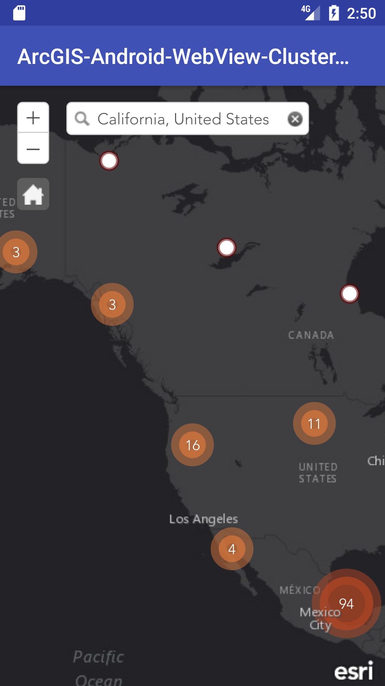

# ArcGIS-Android-WebView-ClusterLayer

A demo for ArcGIS Android WebView Cluster Layer

## Screenshot:

## Usage

1. Please use Android Stuido to open this demo.
2. place the www_soruce content to your web server and the URL on your side should be "http://localhost/cl/" and AVD default IP is 10.0.2.2
3. Run the application and enjoy your coding time.

## Licensing

Copyright 2017 by Esri

Licensed under the Apache License, Version 2.0 (the "License");
you may not use this file except in compliance with the License.
You may obtain a copy of the License at

   http://www.apache.org/licenses/LICENSE-2.0

Unless required by applicable law or agreed to in writing, software
distributed under the License is distributed on an "AS IS" BASIS,
WITHOUT WARRANTIES OR CONDITIONS OF ANY KIND, either express or implied.
See the License for the specific language governing permissions and
limitations under the License.
